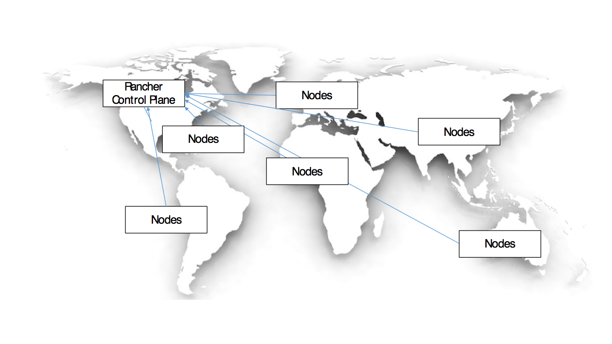

In this deployment scenario, there is a single Rancher control plane managing compute resources across the globe. The control plane would be run in an HA configuration, and there would be impact due to latencies.

<b>Pros:</b>

<li>Environments could have nodes and network connectivity across regions.</li>
<li>Single control plane interface to view/see all regions and environments.</li>

<b>Cons:</b>

<li>Subject to network latencies</li>
<li>If control plane goes out global provisioning of new services is unavailable until restored.</li>

