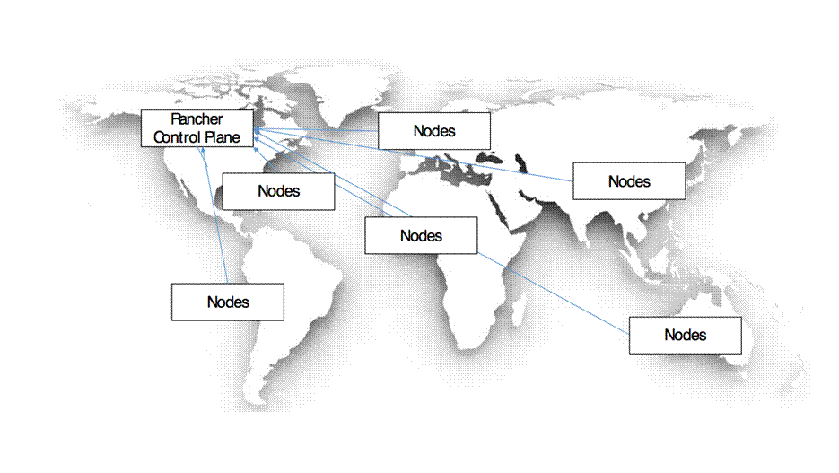

In the regional deployment model a control plane is deployed in close proximity to the compute nodes.

Pros:

Provisioning in regions stay functioning if a control plane in another region go down.

Cons:

Overhead of managing multiple Rancher installations.
