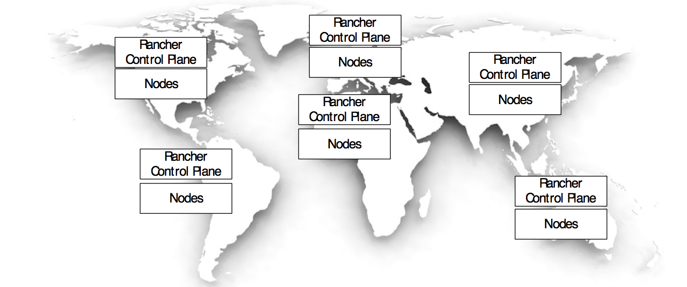

In the regional deployment model a control plane is deployed in close proximity to the compute nodes.

<b>Pros:</b>

<li>Provisioning in regions stay functioning if a control plane in another region go down.</li>

<b>Cons:</b>

<li>Overhead of managing multiple Rancher installations.</li>
