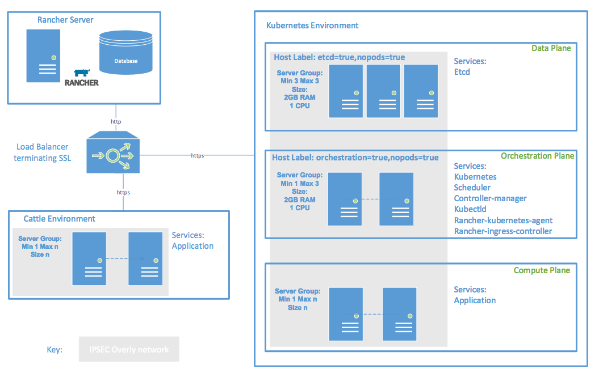

For production deployments, it is best practice that each plane runs on dedicated physical or virtual hosts. For development, multi-tenancy may be used to simplify management and reduce costs. 
<b>Data Plane</b>
Comprised of one or more Etcd nodes which persist state regarding the Compute Plane. Resiliency is achieved by adding 3 hosts to this plane.
Orchestration Plane
Comprised of stateless Kubernetes/Rancher components which orchestrate and manage the Compute Plane:
<li>apiserver</li>
<li>scheduler</li>
<li>controller-manager</li>
<li>kubectld</li>
<li>rancher-kubernetes-agent</li>
<li>rancher-ingress-controller) Resiliency is achieved by adding 2 hosts to this plane</li>
<b>Compute Plane</b> 
Comprised of the real workload (Kubernetes pods), orchestrated and managed by Kubernetes.

