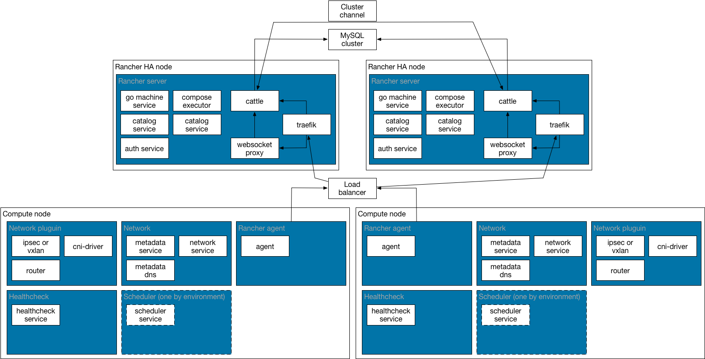

<b>Planning</b>

Rancher HA creates a cluster channel between cattle component at tcp port 9345. This channel is used to communicate cluster info and coordinate cattle nodes. 
Additionally, you need an external load balancer to distribute agents and users requests to all cattle backends.

<b>MySQL</b> 
Rancher Server uses MySQL as its back end database.  While setup and operations of an HA MySQL cluster is out of scope of this document, we do suggest a cluster of 3 MySQL servers. At least 1x primary server and 1x replica, 2x replicas would be preferred. Having a second replica allows you to have an HA cluster while one is performing backups or maintenance. In an HA setup, you should plan on having 50 connections per Rancher server to the database. We recommend a setting of at least 250 Max connections for any HA setup. 
Rancher is able to use MySQL, MariaDB and Percona variants.  
For hardware in a production level system we recommend the following hardware specs. 
<li>8GB of memory for larger installs</li>
<li>128 GB of fast SSD disk</li> 
Using Galera/PCX cluster is also an option. This is a multi-leader cluster of MySQL fronted by a load balancer, in the Rancher use case though only a single server should be performing reads and writes at a time due to transaction locking. 

<b>Disaster Recovery</b> 
In the event of a catastrophic failure the MySQL database is the most critical part that needs to be restored. 
The MySQL database should have regular snapshots and backups that can be used to restore the DB in the event of a catastrophic failure. In high changing environments that cannot easily be rebuilt the backups should be taken in 10-20 minute intervals from one of the replicas.  

